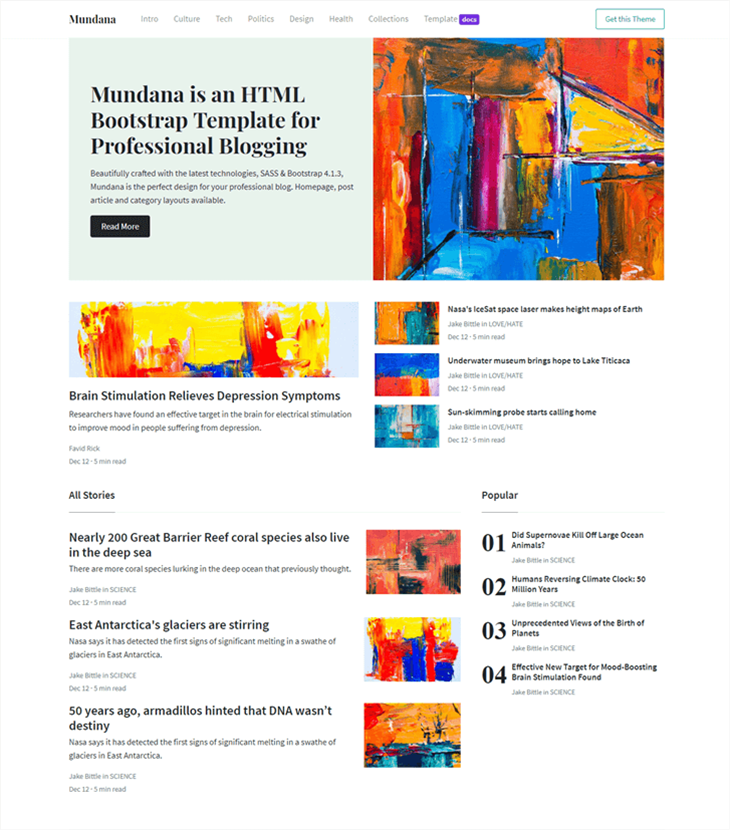

# Mundana - Free Bootstrap HTML Blogging Template

Free HTML Bootstrap Blogging Template by [Sal](https://www.wowthemes.net).

[Live Demo](https://wowthemesnet.github.io/template-mundana-bootstrap-html/) &nbsp; | &nbsp; [Download](https://github.com/wowthemesnet/template-mundana-bootstrap-html/archive/master.zip)

## Getting Started

* [Theme Details](https://www.wowthemes.net/mundana-free-html-bootstrap-template/)
* [Documentation](https://wowthemesnet.github.io/template-mundana-bootstrap-html/docs.html).

## Built With

* [Bootstrap](https://github.com/twbs/bootstrap)
* [Gulp](https://gulpjs.com/)
* [SASS](https://sass-lang.com/)

## Copyright

Copyright (C) 2019 WowThemes.net.

Designed and developed by [Sal](https://www.wowthemes.net), *free* under MIT license. 

## Contribute

Let's make this even better!

- [Clone the repo](https://github.com/wowthemesnet/template-mundana-bootstrap-html.git).
- Create a branch off of master and give it a meaningful name (e.g. my-new-feature).
- Open a pull request on GitHub and describe the feature or fix.

Thank you for your support!